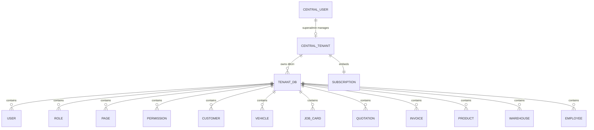
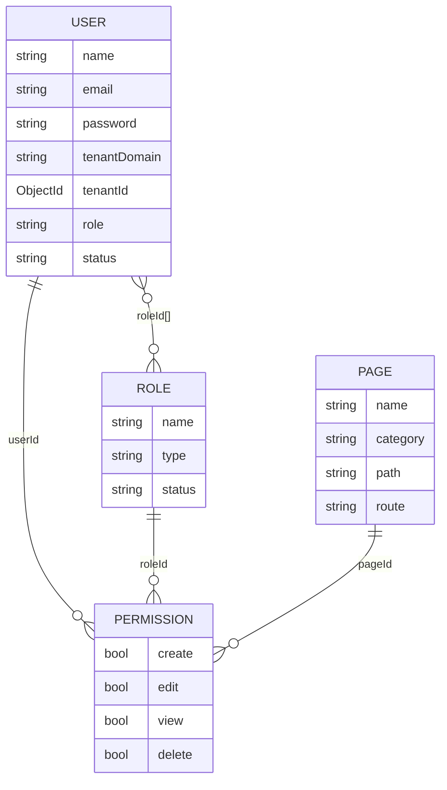
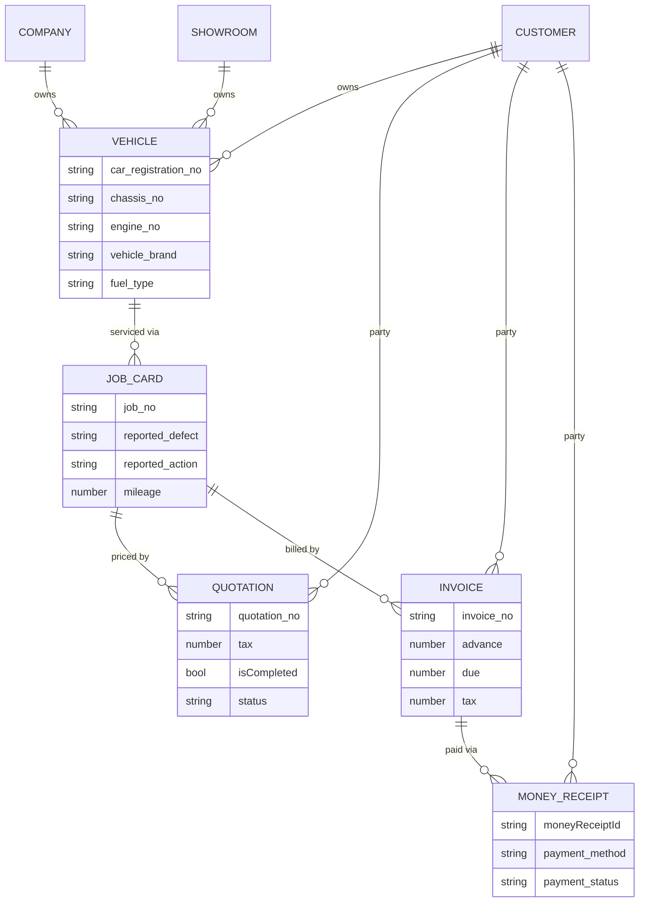
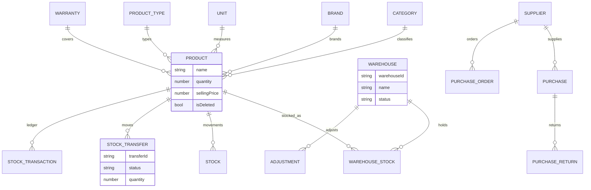
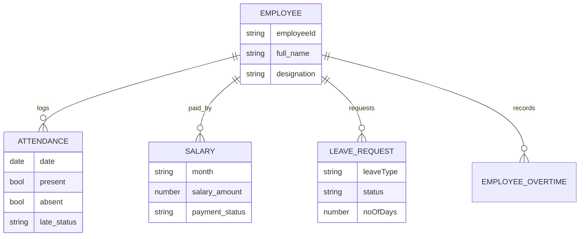

# Garage Master — Multi-Tenant Garage Management SaaS

> Enterprise-grade **multi-tenant SaaS** for auto workshops and garage businesses.  
> Each garage (tenant) gets an **isolated MongoDB database**, RBAC, subscription billing, inventory, HR, and a full workshop workflow from job card → quotation → invoice → money receipt.

**Repository focus:** Node.js / Express / TypeScript API (`garage-master`)  
**Product stack:** MongoDB · Express · React · Redux · Redis · JWT · Cloudinary · Puppeteer (PDF) · subscription & operational payments

---

## Table of contents

1. [Why this project](#1-why-this-project)
2. [Tech stack](#2-tech-stack)
3. [Architecture overview](#3-architecture-overview)
4. [Getting started (for developers)](#4-getting-started-for-developers)
5. [Environment variables](#5-environment-variables)
6. [Multi-tenant database design](#6-multi-tenant-database-design)
7. [Core business domains & features](#7-core-business-domains--features)
8. [Authentication, RBAC & security](#8-authentication-rbac--security)
9. [Redis usage](#9-redis-usage)
10. [Subscriptions & payments](#10-subscriptions--payments)
11. [API reference](#11-api-reference)
12. [Project structure](#12-project-structure)
13. [Scripts & tooling](#13-scripts--tooling)
14. [Deployment notes](#14-deployment-notes)
15. [Roadmap / extensibility](#15-roadmap--extensibility)

---

## 1. Why this project

Garage Master is built as a **B2B SaaS platform**, not a single-shop app:

| Capability | What it demonstrates |
|------------|----------------------|
| **Database-per-tenant isolation** | Strong data isolation for enterprise customers |
| **Central control plane** | Tenants, superadmin, subscriptions, leads, branding |
| **Workshop vertical** | Job cards, quotations, invoices, money receipts, vehicles |
| **Inventory & warehouse** | Products, stock, transfers, purchases, returns, barcodes |
| **HR & payroll** | Employees, attendance, salary, leave, overtime |
| **Fine-grained RBAC** | Pages + CRUD permissions + roles, Redis-cached |
| **Ops readiness** | Helmet, dynamic CORS, JWT cookies, cron backups, PDF exports |

Suitable as a portfolio piece for **senior / advanced full-stack** roles: multi-tenancy, domain-driven modules, and production-oriented Express architecture.

---

## 2. Tech stack

### Backend (this repository)

| Layer | Technology |
|-------|------------|
| Runtime | Node.js |
| Framework | Express.js |
| Language | TypeScript |
| ODM | Mongoose (MongoDB) |
| Cache | Redis (`ioredis`) |
| Auth | JWT (access + refresh), httpOnly cookies + Bearer |
| Validation | Zod |
| Security | Helmet, dynamic CORS, bcrypt |
| Media | Cloudinary + Multer |
| PDF | Puppeteer + EJS templates |
| Jobs | `node-cron` (daily MongoDB backup) |
| Email | Nodemailer |
| Scaffolding | Plop (`generate:module`) |

### Frontend (companion client — React + Redux)

The dashboard SPA (typically Vite on port `5173`) consumes this API with:

- **React** for UI
- **Redux** (or Redux Toolkit) for auth, tenant context, and feature state
- Cookie / Bearer token session against `/api/v1/auth`
- Tenant scoping via `tenantDomain` (query/body) and CORS-allowed origin

> This folder is the **API**. Point the React client’s `VITE_API_URL` (or equivalent) to `http://localhost:7000`.

### Real-time & payments (product direction)

| Concern | Current status in this API |
|---------|----------------------------|
| **Redis** | Production use: CORS allowlist, user session cache, permission cache |
| **SaaS subscription** | Manual plans (`Monthly` / `HalfYearly` / `Yearly`) + renew endpoint; `paymentMethod: Manual \| Gateway` (gateway hook ready) |
| **Workshop payments** | Money receipts, supplier payments, bill-pay with Cash / Bkash / Nagad / Rocket / Card / Bank / Check |
| **WebSockets** | Not wired in this backend yet — designed to plug in for live job-board / notifications on top of Redis (see [Roadmap](#15-roadmap--extensibility)) |

---

## 3. Architecture overview

```
┌─────────────────────────────────────────────────────────────────┐
│                     React + Redux Client                         │
│              (tenant subdomain / custom domain)                  │
└────────────────────────────┬────────────────────────────────────┘
                             │ HTTPS + cookies / Bearer JWT
                             ▼
┌─────────────────────────────────────────────────────────────────┐
│                 Express API  (/api/v1)  · Port 7000               │
│  Helmet · dynamic CORS · auth · RBAC · Zod · tenant resolver     │
└──────────────┬──────────────────────────────┬───────────────────┘
               │                              │
               ▼                              ▼
    ┌──────────────────┐            ┌──────────────────┐
    │  Central MongoDB │            │ Redis (ioredis)  │
    │  Tenants, Super  │            │ CORS / user /    │
    │  admin, Contact, │            │ permission cache │
    │  Subscriptions   │            └──────────────────┘
    └────────┬─────────┘
             │ resolve tenant.dbUri
             ▼
┌────────────────────────────────────────────────────────────────┐
│              Tenant DB₁ · Tenant DB₂ · Tenant DBₙ                │
│  Users, JobCards, Invoices, Inventory, HR, Warehouse, …         │
│  (mongoose.createConnection + in-memory connection pool)         │
└────────────────────────────────────────────────────────────────┘
```

### Request → tenant resolution

1. Client sends **`tenantDomain`** (query string and/or body), optionally `x-tenant-domain`.
2. API loads `Tenant` from the **central** database (`domain` or `_id`).
3. Requires `tenant.isActive`.
4. Opens or reuses `mongoose.createConnection(tenant.dbUri)` via an in-memory map keyed by `tenantId`.
5. Binds shared Mongoose schemas onto that connection (`getTenantModel`).

**Isolation model:** **database-per-tenant** (stronger than shared-collection `tenantId` filtering).

---

## 4. Getting started (for developers)

### Prerequisites

- Node.js **18+** (20 LTS recommended)
- MongoDB Atlas (or local MongoDB) with permission to create databases
- Redis server
- Chromium / Chrome (for PDF generation via Puppeteer)
- Git

### 1) Clone & install

```bash
cd backend
npm install
# or: PUPPETEER_SKIP_CHROMIUM_DOWNLOAD=true npm install
```

### 2) Redis (Linux)

```bash
sudo apt install redis-server
sudo systemctl enable redis
sudo systemctl start redis
redis-cli ping   # → PONG
```

### 3) Environment

```bash
cp .env.example .env
```

Fill secrets locally (never commit real credentials). See [Environment variables](#5-environment-variables).

### 4) Run API

```bash
npm run dev      # ts-node-dev on PORT=7000
# or
npm run build && npm start
```

Health check:

```bash
curl http://localhost:7000/
# { "success": true, "status": 200, "message": "Welcome to the API" }
```

### 5) First login

On boot, the API seeds a **central superadmin** (`role: superadmin`) using `SUPER_ADMIN_PASSWORD`.

```http
POST /api/v1/auth/login
Content-Type: application/json

{ "name": "superadmin", "password": "<SUPER_ADMIN_PASSWORD>" }
```

Then create a tenant:

```http
POST /api/v1/tenants
```

Tenant creation **automatically**:

- Creates a dedicated MongoDB database (`domain` → `dbName`, e.g. `garage.example.com` → `garage_example_com`)
- Seeds default **pages**, **roles** (`admin`, `manager`, `employee`)
- Creates tenant **admin** user with full CRUD permissions
- Creates initial **subscription** document

### 6) Generate a new module (optional)

```bash
npm run generate:module
# or: npx plop module
```

### 7) RBAC migration for existing tenants

```bash
npm run migrate:rbac
```

### Frontend pairing

1. Start this API on `7000`.
2. Start the React + Redux client (usually `5173`).
3. Ensure the client origin is listed in `DEV_ALLOWED_ORIGINS` (or matches an active tenant domain for dynamic CORS).
4. Pass `tenantDomain` on API calls after login.

---

## 5. Environment variables

Documented **names only** — use placeholders in shared docs; keep secrets in `.env`.

| Variable | Purpose |
|----------|---------|
| `PORT` | API port (default `7000`) |
| `CENTRAL_DB_URI` | Central MongoDB connection string |
| `NODE_ENV` | `development` \| `production` |
| `NEXT_PUBLIC_IMAGE_BASE_URL` | Public base URL for assets/API |
| `DB_NAME` | Logical name used by backup tooling |
| `CLOUDINARY_NAME` / `CLOUDINARY_API_KEY` / `CLOUDINARY_SECRET` | Media uploads |
| `CHROME_BIN` | Chromium path for Puppeteer PDFs |
| `JWT_ACCESS_SECRETE` / `JWT_REFRESH_SECRETE` | JWT secrets (names as in repo) |
| `JWT_ACCESS_EXPIRES_IN` / `JWT_REFRESH_EXPIRES_IN` | e.g. `1D`, `365D` |
| `SUPER_ADMIN_PASSWORD` | Seeded central superadmin password |
| `DEFAULT_PASS` / `BCRYPT_SALT_ROUND` | Password hashing config |
| `EMAIL_USER` / `EMAIL_PASS` | Nodemailer |
| `REDIS_HOST` / `REDIS_PORT` / `REDIS_PASSWORD` | Redis |
| `DEV_ALLOWED_ORIGINS` | Comma-separated CORS origins for local/dev |

---

## 6. Multi-tenant database design

### 6.1 Two-layer model



| Layer | Database | Responsibility |
|-------|----------|----------------|
| **Central** | `CENTRAL_DB_URI` | Platform: `Tenant`, superadmin `User`, `Contact`, `CompanyBrand`, `Review`, subscription registry |
| **Tenant** | Dedicated DB per garage (`tenant.dbUri`) | All operational data for that garage only |

### 6.2 Central collections

#### `Tenant`

| Field | Type | Notes |
|-------|------|--------|
| `name` | string | Garage / company display name |
| `domain` | string (unique) | Tenant identifier used by API & CORS |
| `businessType` | string | Optional classification |
| `dbUri` | string | Full Mongo URI for this tenant’s database |
| `subscription` | subdocument | Plan, dates, paid/active flags |
| `isActive` | boolean | Soft kill-switch for the whole tenant |

#### `Subscription` (platform billing)

| Field | Values / notes |
|-------|----------------|
| `plan` | `Monthly` \| `HalfYearly` \| `Yearly` |
| `status` | `Active` \| `Expired` \| `Pending` |
| `isPaid` / `isActive` | Gate login & access |
| `paymentMethod` | `Manual` \| `Gateway` |
| `amount` | Plan price |
| `startDate` / `endDate` | Billing window |

Renewal reference pricing in service logic: Monthly **2000**, HalfYearly **12000**, Yearly **24000** (currency as configured by product).

#### Other central entities

- **Contact** — marketing / lead form (`name`, `email`, `garageName`, `phone`, `message`)
- **CompanyBrand** — platform branding assets
- **Review** — testimonials (model present; route may be unmounted)

### 6.3 Tenant database — domain model

#### Identity & access



#### Workshop workflow (core vertical)



**Typical garage flow**

1. Register **Customer / Company / Showroom** + **Vehicle**
2. Open **Job Card** (defects, actions, technician, mileage)
3. Issue **Quotation** (parts + services, VAT/discount)
4. Convert / create **Invoice**
5. Collect **Money Receipt** (`advance` | `final`)
6. Export **PDF** (Puppeteer + EJS) for job card / quotation / invoice / receipt

#### Inventory & warehouse



#### HR & payroll



#### Finance (tenant operations)

| Collection | Purpose |
|------------|---------|
| `Income` | Operational income lines linked to invoices / services |
| `Expense` + `ExpenseCategory` | Workshop expenses |
| `BillPay` | Supplier / bill settlements (bank, check, wallets, card) |
| `Donation` | Optional donation tracking |
| `Supplier.payments[]` | Running due/paid/balance with method enums |

#### Catalog & misc tenant collections

| Model | Highlights |
|-------|------------|
| `Barcode` | Generated barcodes linked to products (Cloudinary assets) |
| `Note` | Notes attached to customer / company / showroom |
| `CompanyProfile` | Tenant letterhead: name, phones, logo, office hours |
| `Adjustment` | Stock quantity adjustments per warehouse |

### 6.4 Soft delete / recycle bin

Many entities support recycle workflows:

- `isRecycled` / `recycledAt` (or equivalent)
- `PATCH .../recycle/:id`, `PATCH .../restore/:id`
- permanent delete endpoints
- bulk recycle/restore on several party modules

### 6.5 Connection pooling strategy

```ts
// Conceptual — see src/server.ts
tenantConnections: Record<string, mongoose.Connection>

connectToTenantDatabase(tenantId, dbUri) {
  if (cached) return cached;
  const conn = await mongoose.createConnection(dbUri).asPromise();
  tenantConnections[tenantId] = conn;
  return conn;
}
```

Schemas are registered once per connection via `getTenantModel(tenantIdentifier, modelName)`.

---

## 7. Core business domains & features

### A. SaaS control plane

- Create / list / update / delete **tenants**
- **Renew subscription** by plan
- Central **superadmin**
- **Contact** lead capture
- **Company brand** assets

### B. Workshop operations

- Customers, companies, showrooms
- Vehicles (registration, chassis, engine, brand/model, mileage history)
- Job cards + PDF preview
- Quotations (including pending queue) + PDF
- Invoices + PDF
- Money receipts (due list, advance/final) + PDF

### C. Inventory & purchasing

- Products, categories, brands, units, product types, warranties, barcodes
- Multi-warehouse stock + warehouse-stock balances
- Stock transfers & stock transactions
- Purchases, purchase orders, purchase returns (with approve)
- Stock adjustments

### D. HR

- Employees (with recycle bin)
- Attendance (today / by date / month)
- Salary + partial payment history + statistics
- Leave requests
- Overtime
- Holidays

### E. Accounting helpers

- Income & expense modules
- Bill payments
- Donations
- Meta endpoints: customer aggregates & accounting summary

### F. Access control UI surface

Seeded dashboard pages cover (non-exhaustive):

- User / role / permission / page management
- Job card, customer, invoice, quotation, money receipt flows
- Employee, salary, attendance, leave, overtime
- Inventory, warehouse, purchase, supplier
- Recycle bins per domain

### G. Platform ops

- Daily **MongoDB backup** cron (`0 0 * * *`)
- Manual backup / restore / download / backup-logs HTTP endpoints
- Application logs endpoint

---

## 8. Authentication, RBAC & security

### Auth endpoints

| Method | Path | Description |
|--------|------|-------------|
| `POST` | `/api/v1/auth/login` | Superadmin (central) or tenant user (scans active **paid** tenants by `name`) |
| `POST` | `/api/v1/auth/logout` | Clears auth cookies |
| `GET` | `/api/v1/auth/me` | Current session (refresh if needed) |
| `POST` | `/api/v1/auth/refresh-token` | Refresh from cookie |

**Login body:** `{ "name": string, "password": string }`

**JWT claims (tenant user):** `userId`, `role`, `name`, `tenantId`, `domain`

**Cookies:** `accessToken`, `refreshToken` — `httpOnly`, `secure`, `sameSite: 'none'` (cross-site SPA). Tokens are also returned in the JSON body for non-cookie clients.

### RBAC model

| Concept | Behavior |
|---------|----------|
| **Page** | Named dashboard route (`path` / `route`) |
| **Role** | Types include `admin`, `manager`, `employee`, `technician`, `front-desk`, `accountant`, `warehouse`, … |
| **Permission** | CRUD flags: `create`, `edit`, `view`, `delete` bound to user and/or role and page |
| **checkPermission** | Middleware; results cached in Redis (~300s) |

On tenant create, **admin** receives full CRUD on all seeded pages.

### Security middleware stack

- `helmet`
- `cookie-parser`
- **Dynamic CORS** (tenant domains + `DEV_ALLOWED_ORIGINS`, Redis-cached)
- JWT Bearer auth middleware
- Zod `validateRequest` on module routes
- Centralized `globalErrorHandler` + `notFound`
- Subscription gate on login (`isPaid`, `isActive`, `endDate`)

---

## 9. Redis usage

| Key pattern | TTL | Purpose |
|-------------|-----|---------|
| `cors:domain:{origin}` | ~5 min | CORS allowlist cache |
| `user:{domain}:{userId}:data` | ~900s | Auth user hydration |
| `permission:{domain}:check:{userId}:{pagePath}:{action}` | ~300s | RBAC decision cache |

Client: `src/app/utils/redis.ts` (`REDIS_HOST`, `REDIS_PORT`, `REDIS_PASSWORD`).  
Connected on app boot; graceful disconnect on `SIGINT` / `SIGTERM`.

---

## 10. Subscriptions & payments

### Platform SaaS billing

| Aspect | Implementation |
|--------|----------------|
| Plans | Monthly / HalfYearly / Yearly |
| Status | Active / Expired / Pending |
| Methods | `Manual` (primary) · `Gateway` (extensible enum) |
| Renew API | `PATCH /api/v1/tenants/renew-subscription/:id` |
| Enforcement | Unpaid / expired tenants skipped at login |

> A gateway provider (e.g. Stripe / SSLCommerz) can attach to `paymentMethod: "Gateway"` without redesigning the subscription schema.

### In-tenant payment operations

Not card-processor integrations — **domain payments** for garage accounting:

- Money receipts against invoices
- Supplier payments (Cash, Bkash, Nagad, Rocket, Check, Card, Bank Transfer, Other)
- Bill-pay with wallet / bank / card fields
- Salary payment history

---

## 11. API reference

**Base URL:** `http://localhost:7000/api/v1`  
**Tenant scoping:** pass `tenantDomain` on most business routes (query or body).

### Platform & ops

| Method | Endpoint | Notes |
|--------|----------|-------|
| `GET` | `/` | Welcome (root, not under `/api/v1`) |
| `GET` | `/api/v1/logs` | App logs |
| `POST` | `/api/v1/backup` | Trigger backup |
| `POST` | `/api/v1/restore` | Restore |
| `GET` | `/api/v1/download-backup` | Download archive |
| `GET` | `/api/v1/backup-logs` | Backup logs |

### Auth · Tenants · Users · RBAC

| Prefix | Key routes |
|--------|------------|
| `/auth` | `POST /login`, `POST /logout`, `GET /me`, `POST /refresh-token` |
| `/tenants` | `POST /`, `GET /`, `PUT /:id`, `DELETE /:id`, `PATCH /renew-subscription/:id` |
| `/user` | CRUD, recycle/restore/permanent, `POST /:userId/role`, `GET /:userId/permissions` |
| `/role` | CRUD + `POST /:roleId/permissions` |
| `/page` | CRUD |
| `/permission` | batch create/update/delete, my/user permissions |

### Parties & workshop

| Prefix | Key routes |
|--------|------------|
| `/customers` | CRUD + recycle/restore/permanent (+ bulk) |
| `/companies` | same pattern |
| `/showrooms` | same pattern |
| `/vehicles` | CRUD |
| `/jobCards` | CRUD, get by job no, PDF `GET /jobcard/:jobcardId`, recycle-bin |
| `/quotations` | CRUD, dashboard, PDF, pending/recycle flows |
| `/invoices` | CRUD, PDF `GET /invoice/:invoiceId`, recycle flows |
| `/money-receipts` | CRUD, due list, PDF, recycle flows |

### Inventory · warehouse · purchasing

| Prefix | Key routes |
|--------|------------|
| `/products` · `/product-type` · `/category` · `/brand` · `/unit` · `/barcode` · `/warranties` | Catalog CRUD |
| `/warehouse` · `/warehouse-stocks` | Warehouse + balances |
| `/stocks` | Stock CRUD + `POST /transfer` |
| `/stock-transfer` · `/stock-transaction` · `/adjustment` | Movements & adjustments |
| `/purchases` · `/purchase-orders` · `/purchase-return` | Procurement (`PATCH /:id/approve` on returns) |
| `/suppliers` | CRUD, profile, payments, recalc totals |

### HR · finance · misc

| Prefix | Key routes |
|--------|------------|
| `/employees` | CRUD + recycle |
| `/attendances` | create, today, by date, month, remove |
| `/salary` | CRUD, payment, history, statistics |
| `/leave-requests` · `/employee-overtime` · `/holiday` | HR workflows |
| `/incomes` · `/expenses` · `/bill-pays` · `/donation` | Finance |
| `/company-profile` | `POST /create`, `GET /`, `PUT /update/:id` |
| `/notes` · `/contact` · `/company-brand` | Notes / leads / brand |
| `/meta` | `GET /`, `GET /allcustomer`, `GET /accounting-summary` |

> Exact paths live in `src/app/routes/index.ts` and each `*.route.ts`. Prefer those files as the source of truth when extending the API.

---

## 12. Project structure

```
backend/
├── src/
│   ├── server.ts                 # Central + tenant connections, listen, seedSuperAdmin
│   ├── app.ts                    # Express app, CORS, Redis, cron backup, routes
│   ├── crons/                    # Subscription expiry checker (available)
│   ├── scripts/                  # RBAC migration for existing tenants
│   └── app/
│       ├── config/               # Env → typed config
│       ├── routes/index.ts       # Module mount table
│       ├── middlewares/          # auth, permission, CORS, tenant, errors, …
│       ├── modules/              # Feature modules (route/controller/service/model/…)
│       ├── contact/              # Central lead contact
│       ├── builder/              # QueryBuilder helpers
│       ├── errors/               # AppError + Mongoose/Zod handlers
│       ├── templates/            # EJS PDF templates
│       └── utils/                # redis, getTenantModels, backup, cloudinary, email, …
├── plop-templates/               # Module generator templates
├── public/                       # Static + backup artifacts
├── package.json
└── README.md
```

**Module convention:** each feature is a self-contained folder:

`*.route.ts` → `*.controller.ts` → `*.service.ts` → `*.model.ts` / `*.interface.ts` / `*.validation.ts`

---

## 13. Scripts & tooling

| Script | Command | Purpose |
|--------|---------|---------|
| Develop | `npm run dev` | Hot reload on port 7000 |
| Build | `npm run build` | `tsc` + copy EJS templates |
| Start | `npm start` | Run `dist/server.js` |
| Lint | `npm run lint` / `lint:fix` | ESLint |
| Format | `npm run prettier` | Prettier |
| Module gen | `npm run generate:module` | Plop scaffold |
| RBAC migrate | `npm run migrate:rbac` | Seed/migrate tenant RBAC |

---

## 14. Deployment notes

- Build output: `dist/server.js` (see `vercel.json` for serverless-oriented packaging if used)
- Ensure **Redis**, **MongoDB**, and **Chromium** (`CHROME_BIN`) are available in the target environment
- Set `NODE_ENV=production` and strong JWT secrets
- Configure production CORS via active tenant domains + allowed origins
- Cookie auth expects HTTPS (`secure: true`, `sameSite: 'none'`)

---

## 15. Roadmap / extensibility

Designed for growth without rewriting the tenancy core:

| Area | Direction |
|------|-----------|
| **Payment gateway** | Implement provider behind `paymentMethod: "Gateway"` + webhook → activate subscription |
| **WebSockets** | Add Socket.IO (or similar) for live job-card boards, stock alerts, notifications; use Redis adapter for multi-instance |
| **Subscription cron** | Wire `src/crons/subscriptionExpiryChecker.ts` into app boot |
| **Stricter RBAC** | Enable `checkPermission` consistently on all mutating routes |
| **Observability** | Structured logging, metrics, per-tenant rate limits |

---

## Interview / portfolio talking points

When presenting this project, emphasize:

1. **Database-per-tenant multi-tenancy** with connection reuse — not a single shared DB with a `tenantId` column.
2. **Central control plane vs tenant operational plane** separation.
3. **Workshop domain modeling**: vehicle → job card → quotation → invoice → money receipt.
4. **RBAC** with page-level CRUD and Redis caching.
5. **Operational maturity**: PDF generation, soft-delete recycle bins, backups, dynamic CORS for custom domains.
6. **Full-stack product thinking**: Express API + React/Redux client + Redis + subscription lifecycle.

---

## License

ISC — see `package.json`.

---

**Garage Master** · Multi-tenant garage management SaaS · Built for scale, isolation, and real workshop operations.
